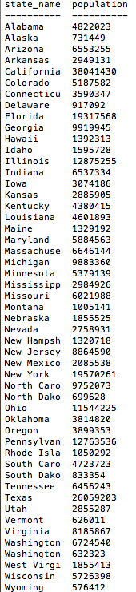
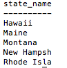
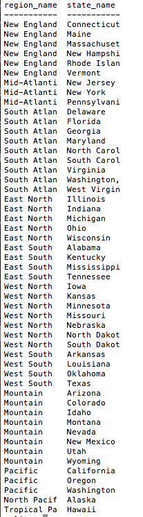

# Introduction to Databases

#### I worked on this challenge by myself.
#### This challenge took me [2] hours.

## Release 4: SQL Queries

Paste the correct SQL queries for each of the following challenges below. There is a screen shot associated with each challenge. You should make sure your query matches the screen shot before moving on.

###1. Select all data for all states.  
  

SELECT * FROM states;

###2. Select all data for the regions.  
  

SELECT * FROM regions;

###3. Select the `state_name` and `population` for all states.  
  

SELECT state_name, population FROM states;

###4. Select the `state_name` and `population` for all states ordered by population. The most populous state should be at the top.  
  

SELECT state_name, population FROM states
ORDER BY population DESC;

###5. Select the 'state_name's for the states in region 7.  
  

SELECT state_name FROM states
WHERE region_id = 7;

###6. Select the 'state_names' and 'population_density' with a population density over 50 ordered from least to most dense.  
  

SELECT state_name, population_density FROM states
WHERE population_density > 50
ORDER BY population_density;

###7. Select all state_names for states with a population between 1 million and 1.5 million people.  
  

SELECT state_name FROM states
WHERE population BETWEEN 1000000 AND 1500000;

###8. Select all state_names and region_id ordered by region in ascending order.  
  

SELECT state_name, region_id FROM states
ORDER BY region_id;

###9. Select the 'region_name' for the regions with "Central" in the name.  
  

SELECT region_name FROM regions
WHERE region_name LIKE  "%Central%";

###10. Select all of the region names and the state names in ascending order by regional id. Refer to the region by name. (This will involve joining the tables).  
  

SELECT regions.region_name, states.state_name
FROM regions
INNER JOIN states
ON regions.id=states.region_id
ORDER BY states.region_id;

## Release 5: `persons` and `outfits` Schema
  

## Release 6: Reflection

### What are databases for?
  Databases are for storing large amounts of data, spanning many descriptive fields.

### What is a one-to-many relationship?
  A one-to-many relationship is a relationship in which one applies exclusively to the other, but that other includes many of the former. 
  The example from the challenge which makes this easy to understand is:
      "'____ belongs to a ____. ____ has many ____.'
      For example, Wisconsin only belongs to the East North Central Region. The East North Central Region has many states."
  One-to-many relationships are a good indicator that data should be split into two tables.

### What is a primary key? What is a foreign key? How can you determine which is which?
  A primary key is a key in a relational database that is unique. There can only be one primary key per database.
  A foreign key is not solely unique - it is a key that identifies and connects its home table to the primary key of another. There can be many foreign keys in a relational database.
  An easy way to tell the difference is that primary keys have unique values and are usually called "id", whereas foreign keys are usually not made up of unique values (though they can be), they may have null values, and they often refer to the linked table by name.

### How can you select information out of a SQL database? What are some general guidelines for that?
  It's pretty semantic, which is nice. Without going to deep, to select the info, do this:
  SELECT (something)(, optional more things) FROM (database_name);
  In those somethings you can put any number of columns, or an asterisk (*), a wildcard character that basically means "all".

