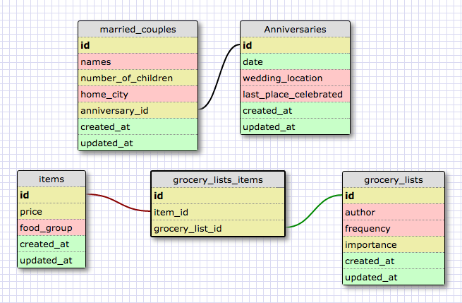

# MORE SCHEMAS

### What is a one-to-one database?
	A one-to-one database has only one associated value per other value. Think capital cities - one country has one capital city and vice-versa.

### When would you use a one-to-one database? (Think generally, not in terms of the example you created).
	Just whenever you have distinct values attached to other distinct values, but they each have various details and categories.

### What is a many-to-many database?
	A many-to-many database has values that connect between tables, but each may have many of the other.

### When would you use a many-to-many database? (Think generally, not in terms of the example you created).
	Whenever you have many values with many other values!

### What is confusing about database schemas? What makes sense?
	It all makes sense, but I need to see like 100 more examples before I totally get it.
